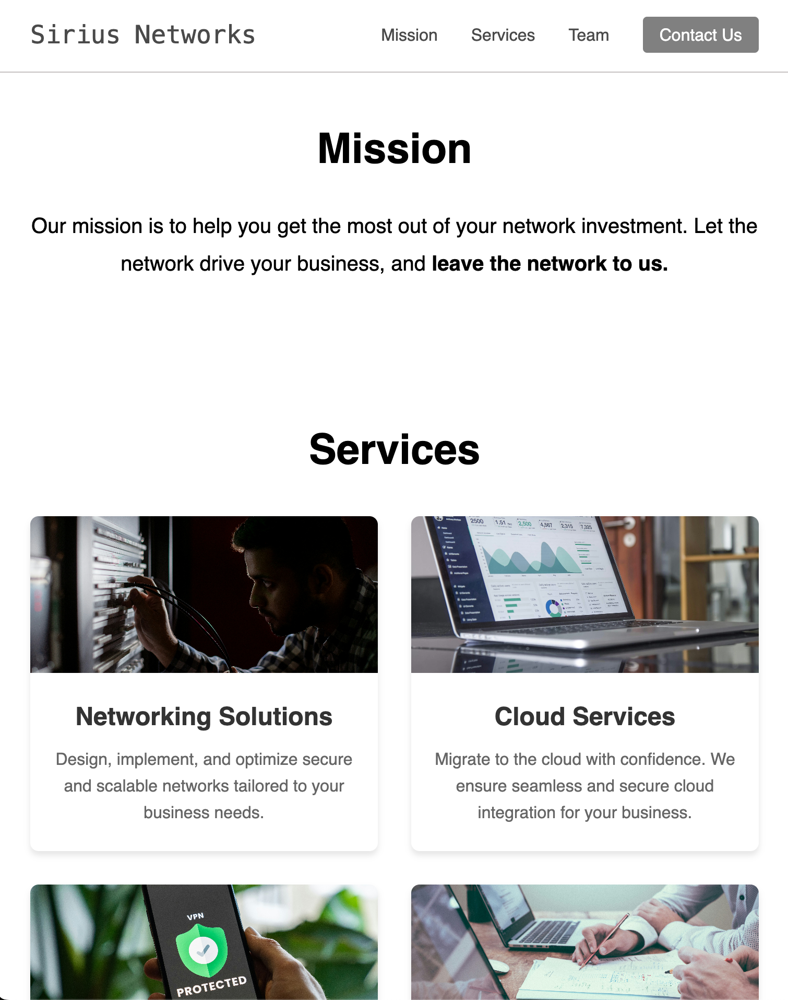
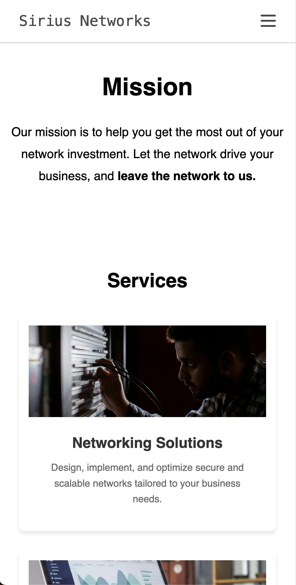

# Codecademy Company Home Page Project

## Table of contents
* [Project Goals](#project-goals)
* [Built with](#built-with)
* [How to use](#how-to-use)
* [Images](#images)

## Project Goals
In this project, you’ll be using flexbox to design and build the layout for a company’s homepage. You can choose to build a new homepage for an existing company or imagine your own dream company!

This site works for: desktops, tablets, and mobile phones.

## Built with
* HTML
* CSS

## How to use
1. Clone the repository and change directory.

```bash
git clone https://github.com/trevoramaco/html-css.company-home-page.git
```

2. Open `html-css.company-home-page/index.html` file.

## Images

- Desktop:


- Tablet:



- Mobile:


